```mermaid
  
%%{init: {
  'theme':'base',
  'themeVariables': {
      'tertiaryColor': '#cccccc',
      'mainBkg': '#e3dada',
      'actorTextColor': '#b1b1b5',
      'actorBkg': '#0c8796',
      'signalColor': '#0c8796',
      'signalTextColor': '#b1b1b5',
      'sequenceNumberColor': '#b1b1b5'
      }
    }
  }%%
 
sequenceDiagram
  autonumber
  participant boto3
  participant botocore
  participant boto_patch
  participant YubiHSM
  boto3->>botocore: Sign this request 📝
  botocore-->>boto_patch: Can you sign this for me? 
  boto_patch-->>YubiHSM: Please sign this
  YubiHSM-->>boto_patch: All done 🔐
  boto_patch->>boto3: Here you go

```

# boto

## Patches

### boto_patch.py

#### Summary

This module will override the SigV4Auth.signature method in botocore.auth allowing the ability to store AWS credentials in the YubiHSM.

Secure the AWS Access Key onto a device that is accessible for developers. No leakage of the AWS Access Key to unauthorized users. In the event that a bad actor script pulls the AWS Credentials file or the environment variables they will not have access to the AWS Access Key. The bad actor would also need access to the YubiHSM to exploit the credentials. In this scenario the signing actions will be recorded on the YubiHSM and can be alerted if they happen outside of normal hours.

Another deployment option would be that each developer has a key chain YubiHSM and removes it when not in use.


<details><summary>How to use:</summary>

##### Step 1.

Configure your credentials file.
vi ~/.aws/credentials

```python
[default]
aws_access_key_id = ........
aws_secret_access_key = hsm|127.0.0.1:1111|1|password|10000
```
  
*aws_secret_access_key* format = hsm|ip:port|userid|password|credid


**hsm** = must be hsm
**ip:port** = ip and port number for the YubiHSM
**userid** = The ID for the user account to access the YubiHSM
**password** = The password for the user account to access the YubiHSM
**credid** = The ID of the HMAC key stored on the YubiHSM. This ID is provided by the YubiHSM.

##### Step 2.

Add the boto_patch to your imports and make the normal boto3 calls. As long as you have boto\_patch imported after boto3 your calls should use the YubiHSM method for signing.

```python
import boto3
import boto_patch

s3_client = boto3.resource('s3')
for bucket in s3.buckets.all():
    print(bucket.name)
```
  
</details>

<details><summary> Diagram </summary>
  


</details>
